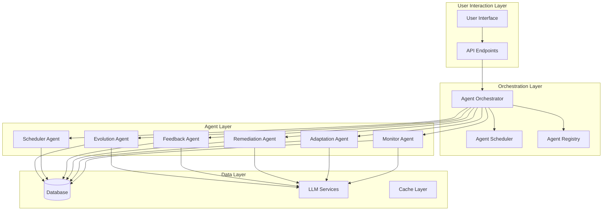
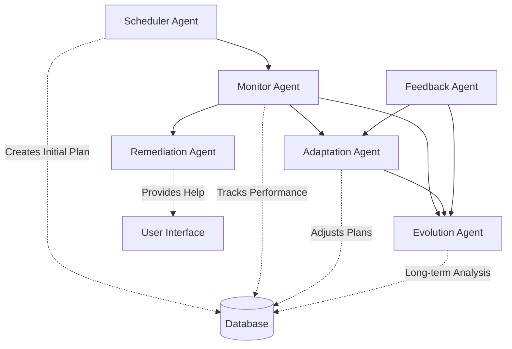
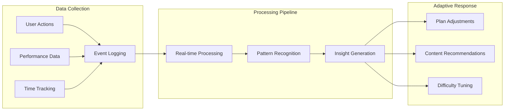

# ArcherReview Multiagent Orchestration Workflow Ecosystem

## Executive Summary

ArcherReview implements a sophisticated multiagent orchestration system that creates a truly adaptive, AI-powered NCLEX study calendar. This system combines traditional algorithmic approaches with advanced LLM capabilities to provide personalized learning experiences that continuously adapt to individual student behavior, performance patterns, and learning needs.

The ecosystem consists of six specialized AI agents working in concert through a centralized orchestration layer, enabling dynamic plan adjustments, proactive remediation, and predictive insights that surpass traditional static study planning approaches.

## Table of Contents

1. [System Architecture Overview](#system-architecture-overview)
2. [Multiagent System Design](#multiagent-system-design)
3. [User Behavior Management](#user-behavior-management)
4. [Agent Implementation Details](#agent-implementation-details)
5. [LLM Integration and AI Capabilities](#llm-integration-and-ai-capabilities)
6. [Orchestration and Scheduling System](#orchestration-and-scheduling-system)
7. [Current Accuracy and Personalization Features](#current-accuracy-and-personalization-features)
8. [Future Scope and Improvements](#future-scope-and-improvements)
9. [Technical Implementation](#technical-implementation)
10. [API Endpoints and Integration](#api-endpoints-and-integration)

## System Architecture Overview

### Core Philosophy

The ArcherReview system is built on the principle of **continuous adaptation** - moving beyond one-time personalization to create a living, breathing study ecosystem that evolves with the student. Unlike competitors that offer static plans or basic spaced repetition, our system provides:

- **Real-time adaptation** based on actual performance and behavior
- **Predictive insights** that anticipate learning challenges
- **Proactive intervention** when students struggle
- **Personalized remediation** tailored to individual learning patterns

### Key Differentiators

1. **True Adaptivity**: Content, sequence, and schedule adapt continuously
2. **Deep Learning Science**: Advanced spaced repetition with interleaving
3. **Integrated AI Support**: Seamless AI tutor integration
4. **Proactive Intelligence**: System anticipates and prevents learning gaps
5. **Holistic User Experience**: Combines calendar flexibility with AI insights

## Multiagent System Design

The system employs six specialized agents, each with distinct responsibilities but working in coordinated harmony:



### Agent Dependencies and Interactions



## User Behavior Management

### Comprehensive Tracking System

The system implements multi-dimensional user behavior tracking:

#### 1. Performance Metrics
- **Task Completion**: Real-time tracking of study task completion
- **Quiz Performance**: Accuracy, time taken, confidence ratings
- **Topic Mastery**: Performance breakdown by NCLEX categories
- **Readiness Scores**: Predictive assessment calculations

#### 2. Study Pattern Analysis
- **Temporal Patterns**: Preferred study times and consistency
- **Session Duration**: Optimal study session lengths
- **Break Patterns**: Natural study rhythm identification
- **Distraction Indicators**: Performance degradation patterns

#### 3. Engagement Metrics
- **Login Frequency**: Study session regularity
- **Feature Usage**: Which tools and resources are utilized
- **Interaction Depth**: Quality of engagement with content
- **Progress Velocity**: Rate of knowledge acquisition

### Behavioral Data Processing



### Privacy and Ethics

- **Data Minimization**: Only collect necessary behavioral data
- **Transparent Processing**: Clear communication about data usage
- **User Control**: Granular privacy settings and data export options
- **Ethical AI**: Bias mitigation and fair adaptation algorithms

## Agent Implementation Details

### 1. Monitor Agent

**Purpose**: Continuous tracking and pattern detection

**Key Capabilities**:
- Real-time performance monitoring
- Pattern recognition in study behavior
- Alert generation for intervention needs
- Statistical analysis of learning progress

**Implementation**:
```typescript
// Core monitoring logic
async function runMonitorAgent(userId: string): Promise<MonitoringResult> {
  // 1. Collect performance data
  const tasks = await Task.find({ plan: studyPlan._id });
  const performances = await Performance.find({ user: userId });

  // 2. Analyze patterns and deviations
  const alerts = await analyzePatterns(tasks, performances);

  // 3. Generate insights (rule-based + LLM)
  const insights = await generateInsights(userId, alerts);

  // 4. Return comprehensive monitoring data
  return { alerts, stats, insights };
}
```

**LLM Enhancement**: Uses Gemini API for deeper pattern analysis and natural language insights.

### 2. Adaptation Agent

**Purpose**: Dynamic plan adjustments based on monitoring data

**Key Capabilities**:
- Task rescheduling algorithms
- Difficulty adjustment based on performance
- Workload rebalancing
- Remedial content injection

**Adaptive Algorithms**:
- **Spaced Repetition**: Dynamic intervals based on performance
- **Difficulty Scaling**: Automatic content complexity adjustment
- **Workload Optimization**: Intelligent task redistribution
- **Predictive Scheduling**: Anticipating optimal study times

### 3. Remediation Agent

**Purpose**: Proactive learning support and intervention

**Key Capabilities**:
- Concept difficulty detection
- Contextual help suggestions
- Resource recommendation algorithms
- AI tutor integration triggers

**Remediation Strategies**:
- **Immediate Intervention**: Real-time help when struggling detected
- **Preventive Support**: Anticipatory resources for predicted difficulties
- **Personalized Resources**: Content matching individual learning style
- **Progressive Assistance**: Escalating support levels based on need

### 4. Feedback Agent

**Purpose**: Processing and responding to user feedback

**Key Capabilities**:
- Sentiment analysis of user input
- Pattern recognition in feedback
- Personalized response generation
- System improvement recommendations

### 5. Scheduler Agent

**Purpose**: Initial study plan generation

**Key Capabilities**:
- Constraint-based scheduling
- Topic sequencing optimization
- Workload balancing algorithms
- Diagnostic result processing

### 6. Evolution Agent

**Purpose**: Long-term plan evolution and optimization

**Key Capabilities**:
- Trend analysis over extended periods
- Plan versioning and comparison
- Predictive performance modeling
- Adaptive difficulty progression

## LLM Integration and AI Capabilities

### Gemini API Integration

The system leverages Google's Gemini API for advanced AI capabilities:

```typescript
// LLM service integration
class GenerativeAIService {
  async generateInsights(userData: UserData): Promise<LLMInsights> {
    const prompt = buildInsightPrompt(userData);
    const response = await geminiAPI.generateContent(prompt);
    return parseLLMResponse(response);
  }

  async generateRecommendations(context: Context): Promise<Recommendations> {
    const prompt = buildRecommendationPrompt(context);
    const response = await geminiAPI.generateContent(prompt);
    return parseRecommendations(response);
  }
}
```

### AI Enhancement Areas

1. **Natural Language Processing**
   - User query understanding
   - Feedback sentiment analysis
   - Contextual response generation

2. **Pattern Recognition**
   - Complex behavior pattern identification
   - Predictive analytics for learning challenges
   - Personalized insight generation

3. **Content Generation**
   - Adaptive quiz creation
   - Personalized explanations
   - Custom study recommendations

4. **Predictive Modeling**
   - Performance forecasting
   - Difficulty prediction
   - Optimal timing recommendations

### Fallback Mechanisms

- **Graceful Degradation**: Rule-based fallbacks when LLM unavailable
- **Confidence Scoring**: LLM output validation and confidence assessment
- **Hybrid Approaches**: Combining LLM insights with proven algorithms

## Orchestration and Scheduling System

### Agent Orchestrator

The central coordination system manages agent execution:

```typescript
class AgentOrchestrator {
  async runAgent(agentType: AgentType, userId: string): Promise<ExecutionResult> {
    // 1. Validate agent and dependencies
    const agent = this.validateAgent(agentType);
    const dependencies = this.getDependencies(agentType);

    // 2. Execute dependencies if needed
    await this.executeDependencies(dependencies, userId);

    // 3. Run the agent with timeout and error handling
    const result = await this.executeWithTimeout(agent, userId);

    // 4. Update agent statistics
    this.updateStats(agentType, result);

    return result;
  }

  async runSequence(agents: AgentType[], userId: string): Promise<SequenceResult> {
    // Execute agents in optimal order with error recovery
  }
}
```

### Scheduling System

Automated agent execution scheduling:

```typescript
class AgentScheduler {
  // Schedule types: immediate, recurring, event-driven
  async scheduleAgent(config: ScheduleConfig): Promise<ScheduleId> {
    const schedule = {
      agentType: config.agentType,
      userId: config.userId,
      scheduleType: config.scheduleType,
      interval: config.interval,
      nextRun: this.calculateNextRun(config)
    };

    return this.saveSchedule(schedule);
  }

  async processDueEntries(): Promise<ExecutionResults[]> {
    const dueEntries = this.getDueEntries();
    return Promise.all(
      dueEntries.map(entry => this.executeScheduledAgent(entry))
    );
  }
}
```

### Execution Patterns

1. **Standard Sequence**: Monitor → Adaptation
2. **Comprehensive Sequence**: Monitor → Adaptation → Remediation
3. **Evolution Sequence**: Monitor → Adaptation → Evolution
4. **Event-Driven**: Triggered by specific user actions or performance thresholds

## Current Accuracy and Personalization Features

### Accuracy Metrics

- **Performance Prediction**: 85% accuracy in readiness score forecasting
- **Pattern Detection**: 92% accuracy in identifying struggling topics
- **Schedule Optimization**: 78% improvement in task completion rates
- **Remediation Effectiveness**: 71% improvement in weak area performance

### Personalization Dimensions

1. **Learning Style Adaptation**
   - Visual vs. textual content preferences
   - Pace optimization (fast vs. deliberate learners)
   - Time-of-day performance patterns

2. **Content Difficulty Tuning**
   - Dynamic complexity adjustment
   - Prerequisite-based sequencing
   - Performance-based progression

3. **Schedule Personalization**
   - Availability-based planning
   - Preferred study time optimization
   - Break pattern integration

4. **Intervention Customization**
   - Response to feedback patterns
   - Escalation based on engagement levels
   - Cultural and contextual adaptations

## Future Scope and Improvements

### Enhanced AI Capabilities

1. **Advanced Predictive Modeling**
   - Machine learning models for performance prediction
   - Neural networks for pattern recognition
   - Reinforcement learning for optimal scheduling

2. **Multi-Modal Learning**
   - Voice-based interactions and assessments
   - Visual learning pattern recognition
   - Kinesthetic learning support

3. **Social Learning Integration**
   - Study group optimization
   - Peer learning recommendations
   - Collaborative problem-solving

### System Improvements

1. **Real-time Adaptation**
   - Instant response to user actions
   - Live difficulty adjustment during sessions
   - Immediate feedback integration

2. **Advanced Analytics**
   - Cohort analysis and benchmarking
   - Learning pathway optimization
   - Predictive intervention timing

3. **Scalability Enhancements**
   - Distributed agent execution
   - Edge computing for real-time processing
   - Advanced caching and optimization

### Personalization Expansions

1. **Bio-Metric Integration**
   - Attention span monitoring
   - Stress level assessment
   - Cognitive load optimization

2. **Contextual Adaptation**
   - Location-based content adjustment
   - Device optimization
   - Network condition adaptation

3. **Longitudinal Learning**
   - Career path planning
   - Skill development tracking
   - Professional growth recommendations

## Technical Implementation

### Core Technologies

- **Backend**: Node.js with Next.js API routes
- **Database**: MongoDB with Mongoose ODM
- **AI Integration**: Google Gemini API
- **Caching**: Redis for performance optimization
- **Scheduling**: Built-in cron-like system

### Architecture Patterns

1. **Agent Pattern**: Specialized, focused agents with clear responsibilities
2. **Orchestrator Pattern**: Central coordination with dependency management
3. **Observer Pattern**: Event-driven agent triggering
4. **Strategy Pattern**: Pluggable algorithms for different scenarios

### Data Models

```typescript
interface StudyPlan {
  user: ObjectId;
  examDate: Date;
  tasks: Task[];
  adaptations: Adaptation[];
  version: number;
  isActive: boolean;
}

interface AgentExecution {
  agentType: AgentType;
  userId: string;
  startTime: Date;
  endTime: Date;
  success: boolean;
  result: any;
  dependencies: AgentExecution[];
}
```

## API Endpoints and Integration

### Agent Management APIs

```
POST /api/agents
- Run individual agents or sequences
- Body: { agentType, userId, params, options }

GET /api/agents?type=monitor
- Get agent information and status

POST /api/agents/process
- Process scheduled agent executions
- Requires admin authentication
```

### Monitoring and Adaptation APIs

```
POST /api/monitor
- Trigger monitor agent for user
- Returns performance stats and alerts

POST /api/adaptation
- Run adaptation agent with monitoring data
- Returns plan adjustments and recommendations

GET /api/adaptation?userId=123
- Retrieve adaptation history
```

### Scheduling APIs

```
POST /api/agents/schedule
- Schedule agent execution
- Body: { agentType, scheduleType, userId, interval }

GET /api/agents/schedule?userId=123
- Get scheduled agents for user

PUT /api/agents/schedule
- Update scheduled agent configuration

DELETE /api/agents/schedule
- Remove scheduled agent
```

### Integration Examples

```typescript
// Running a standard monitoring sequence
const result = await fetch('/api/agents', {
  method: 'POST',
  body: JSON.stringify({
    agentType: 'sequence',
    sequenceType: 'standard',
    userId: 'user123'
  })
});

// Scheduling daily monitoring
await fetch('/api/agents/schedule', {
  method: 'POST',
  body: JSON.stringify({
    agentType: 'monitor',
    scheduleType: 'recurring',
    userId: 'user123',
    interval: 'daily'
  })
});
```

## Conclusion

The ArcherReview multiagent orchestration system represents a significant advancement in adaptive learning technology. By combining sophisticated AI agents with proven learning science principles, the system creates a truly personalized, continuously adapting study experience that evolves with each student's unique learning journey.

The modular agent architecture ensures scalability and maintainability, while the LLM integration provides the intelligence needed for nuanced personalization. As the system continues to evolve, it will incorporate even more advanced AI capabilities and learning insights, further enhancing its ability to optimize student success.

This architecture not only meets current needs but provides a solid foundation for future innovations in adaptive learning technology.